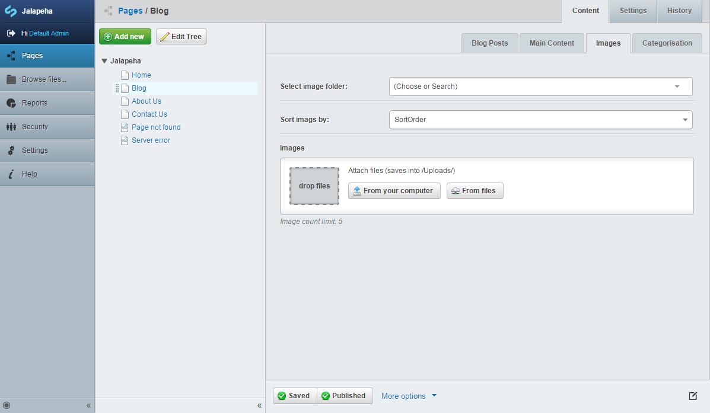

# SilverStripe page image extension

Add additional images to a page

Manage images on pages like BlogPost
(see [Blog](https://github.com/silverstripe/silverstripe-blog.git/ "Blog module") ) using an additional tab in the backend.

Uses a has_one relation to assign a folder containing your images. Offers [UploadField] (https://docs.silverstripe.org/en/3.2/developer_guides/forms/field_types/uploadfield/) sorting using [sortablefile](https://github.com/bummzack/sortablefile).



## Requirements

    bummzack/sortablefile


## Configuration
By default the extension is enabled for Pages.
You can add the extension to other DataObjects by changing the configuration.
See file "config.yml" within "/SS_ROOT/pageimages/_config" folder.
Read more about [silverstripe configuration](http://doc.silverstripe.com/framework/en/topics/configuration).

## Configurable parameter(s) available in config.yml.
If a parameter is not set, default value will be used:
```
# Set a specific folder name to upload to
# Default = Uploads
#  upload_folder_name: 'Uploads'

# Set allowed extensions for images
# Default to types known by file category image
#  allowed_extensions:
#    - jpg
#    - jpeg
#    - gif
#    - png

# Set allowed maximum filesize for images
# Default = 1048576 = 1MB (1* 1024 * 1024)
#  allowed_max_file_size: 1048576
```
